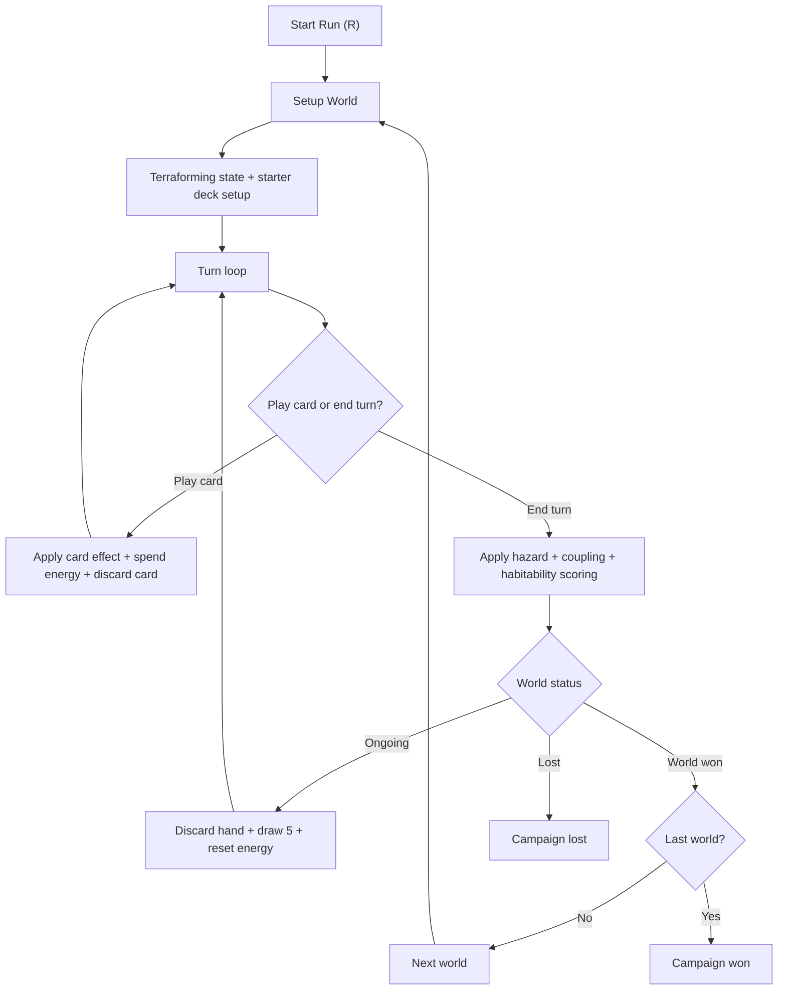

# terraform-trek
A rogue-like game built in Lua and Love2d inspired by Terraforming Mars.

## Current Prototype Loop

The current gameplay prototype is a simple card-driven terraforming system:

- Four terraform primitives:
  - `Heat` and `Water`: range `-10` to `+10` (bipolar; too low or too high are both bad)
  - `Air` and `Soil`: range `-10` to `0` (one-directional health; `0` is ideal)
- A target value for each primitive per world
- One output meter: `Habitability`
- End-turn hazards (intent shown in the HUD)
- End-turn coupling rules:
  - Bipolar stats (`Heat`, `Water`) couple when `|value-target| >= 4`
  - One-directional stats (`Air`, `Soil`) emit stress when far below target (`<= target-6`), support near target (`>= target-3`), and are neutral in the middle
- End objectives:
  - `Population` is turn-based: `+1 base`, plus per-primitive quality (`bad=-1`, `ok=0`, `good=+1`), plus synergy bonus (`+2/+3/+4` for `2/3/4` good primitives)
  - `Profit` is industry-driven: installed industries generate income each turn if they survive environmental damage checks
  - Industry capacity is capped at `4` slots
- Three sequential worlds: low threat, elite, boss
- Interactive Core Influence screen:
  - click a primitive to focus incoming/outgoing effects
  - right-side `End Objectives` panel uses minimalist Population/Profit graphs plus 4 industry slots
  - bottom `Explain Objectives` button opens detailed Population/Profit math and industry breakdown
  - industry slot status is shown directly in End Objectives
  - optional `Explain Graph` and `Explain Next Turn` overlays for deep breakdowns
  - preview end-of-turn outcomes (baseline vs selected card)
  - see best immediate playable card recommendations

### Flow Diagram

See `/Users/garypeters/Documents/GitHub/terraform-trek/gameplay_flow.mmd` for the full gameplay flow diagram.



### Controls

- Click a card or press `1-9`: play card from hand
- Click `END TURN` or press `E`: end turn
- `V`: toggle Core Influence screen
- `M`: toggle real-world notch mapping text
- `C`: clear selected forecast card (on Core Influence screen)
- `I`: cycle influence flow filter (`In + Out`, `Incoming`, `Outgoing`, `All`)
- `Z/X/P`: set map preview mode (`Current` clears selection / `Do Nothing` / `Selected Card`)
- On Core Influence, click `Do Nothing` or any card in the bottom selector to set preview source
- On Core Influence, click `Explain Graph` to open/close primitive and coupling explanations
- On Core Influence, click `Explain Next Turn` to open/close the forecast breakdown
- On Core Influence, click `Explain Objectives` (bottom of End Objectives panel) to open/close objective math details
- `N`: go to next world after a world victory
- `R`: restart run

### Card Library Mode

A separate launch mode is available for browsing all cards and filtering by topic.

- Launch commands:
  - `TERRAFORM_TREK_MODE=cards love .`
  - `love . cards`
- Controls:
  - Click a topic chip to filter cards
  - Click a card to inspect details
  - Mouse wheel or `Up/Down` to scroll
  - `Left/Right` to cycle topics
  - `Esc` to quit

## Running Locally

To run Terraform Trek on your local machine using LÖVE, follow these steps:

### 1. Find Your LÖVE Installation Path

You need to know the path to the LÖVE executable.

*   **macOS:**
    *   If installed in the standard Applications folder, the path to the executable is typically `/Applications/love.app/Contents/MacOS/love`.
    *   You can verify this by right-clicking `love.app` in Finder, selecting "Show Package Contents", and navigating to `Contents/MacOS/`.
*   **Windows:**
    *   The path is usually something like `C:\Program Files\LOVE\love.exe` or `C:\Program Files (x86)\LOVE\love.exe`.
    *   Find where you installed LÖVE and locate `love.exe`.

### 2. Set Up the Launch Script

A script is provided to easily launch the game.

*   **macOS:**
    1.  Make sure the path in `run_local.sh` matches your LÖVE installation path found in step 1. If it's different, edit the last line of the script.
    2.  Open your terminal, navigate to the `terraform-trek` project directory.
    3.  Make the script executable by running: `chmod +x run_local.sh`
    4.  Run the game using: `./run_local.sh`
    5.  Run the card library using: `./run_cards.sh`

*   **Windows:**
    1.  Create a file named `run_local.bat` in the `terraform-trek` project directory.
    2.  Add the following content, **replacing `"C:\Program Files\LOVE\love.exe"` with your actual LÖVE path** found in step 1:
        ```batch
        @echo off
        REM Replace the path below with your actual love.exe path
        "C:\Program Files\LOVE\love.exe" .
        pause
        ```
    3.  Save the file.
    4.  Double-click `run_local.bat` to start the game. The `pause` command keeps the console window open if errors occur.
    5.  Double-click `run_cards.bat` to start card library mode.
