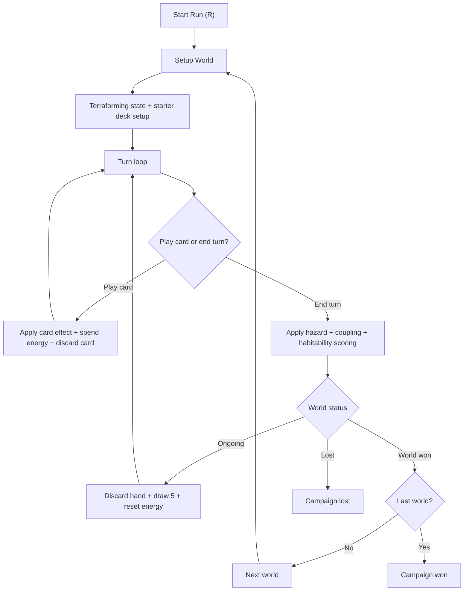

# terraform-trek
A rogue-like game built in Lua and Love2d inspired by Terraforming Mars.

## Current Prototype Loop

The current gameplay prototype is a simple card-driven terraforming system:

- Four terraform primitives: `Heat`, `Air`, `Water`, `Soil` (range `-4` to `+4`)
- A target value for each primitive per world
- One output meter: `Habitability`
- End-turn hazards (intent shown in the HUD)
- End-turn coupling rules where extreme stats push other stats
- Three sequential worlds: low threat, elite, boss

### Flow Diagram

See `/Users/garypeters/Documents/GitHub/terraform-trek/gameplay_flow.mmd` for the full gameplay flow diagram.



### Controls

- Click a card or press `1-9`: play card from hand
- Click `END TURN` or press `E`: end turn
- `N`: go to next world after a world victory
- `R`: restart run

## Running Locally

To run Terraform Trek on your local machine using LÖVE, follow these steps:

### 1. Find Your LÖVE Installation Path

You need to know the path to the LÖVE executable.

*   **macOS:**
    *   If installed in the standard Applications folder, the path to the executable is typically `/Applications/love.app/Contents/MacOS/love`.
    *   You can verify this by right-clicking `love.app` in Finder, selecting "Show Package Contents", and navigating to `Contents/MacOS/`.
*   **Windows:**
    *   The path is usually something like `C:\Program Files\LOVE\love.exe` or `C:\Program Files (x86)\LOVE\love.exe`.
    *   Find where you installed LÖVE and locate `love.exe`.

### 2. Set Up the Launch Script

A script is provided to easily launch the game.

*   **macOS:**
    1.  Make sure the path in `run_local.sh` matches your LÖVE installation path found in step 1. If it's different, edit the last line of the script.
    2.  Open your terminal, navigate to the `terraform-trek` project directory.
    3.  Make the script executable by running: `chmod +x run_local.sh`
    4.  Run the game using: `./run_local.sh`

*   **Windows:**
    1.  Create a file named `run_local.bat` in the `terraform-trek` project directory.
    2.  Add the following content, **replacing `"C:\Program Files\LOVE\love.exe"` with your actual LÖVE path** found in step 1:
        ```batch
        @echo off
        REM Replace the path below with your actual love.exe path
        "C:\Program Files\LOVE\love.exe" .
        pause
        ```
    3.  Save the file.
    4.  Double-click `run_local.bat` to start the game. The `pause` command keeps the console window open if errors occur.
